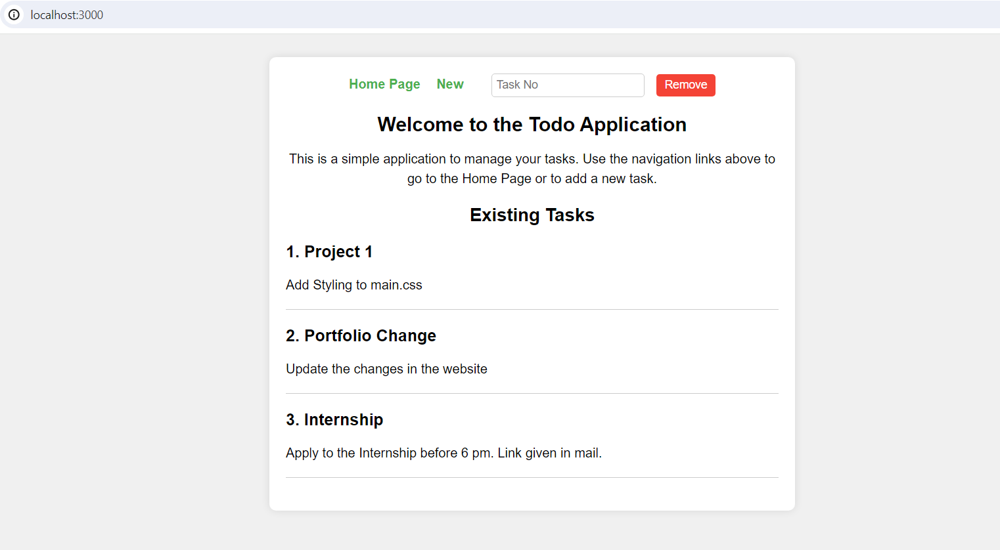

# ToDo Application

Welcome to the ToDo application! This application helps you manage your tasks effectively.



## Installation

Follow these steps to run the ToDo application on your local machine:

1. **Clone the repository:**
   
   ```bash
   git clone https://github.com/JyothishRK/To-do-app.git
   cd To-do-app
   ```

2. **Install dependencies:**
   
   ```bash
   npm install
   ```

3. **Start the application:**
   
   ```bash
   node index.js
   ```

4. **View the application:**
   
   - Open a web browser and go to `http://localhost:3000`.
   - You can also specify a different port by changing the `PORT` variable in the code(index.js) before starting the application.

## Screenshots

### ToDo Application Page


### New Task Creation Page


## Usage

- **Adding a New Task:**
  1. Click on the "New" button.
  2. Fill out the task details.

- **Deleting a Task:**
  - Click on the delete icon after entering the task number to remove it from the list.

## Additional Details

- This application uses Node.js and Express for the backend, and it stores tasks in memory (not persistent storage like a database).
- You can customize the appearance and functionality further by modifying the `index.js` and `views` files as needed.